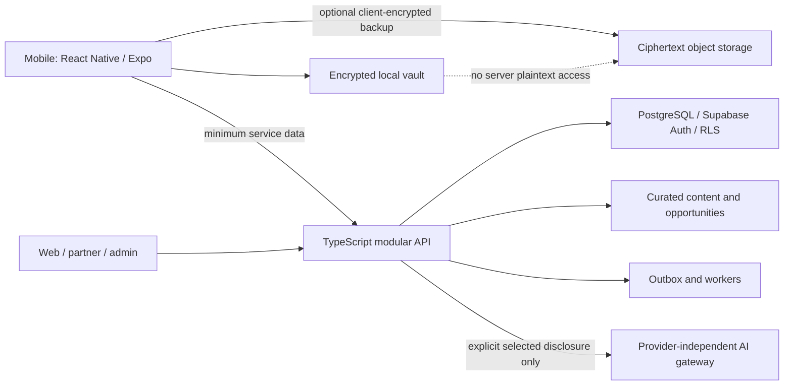

# HerPages

## An app that grows with her.

**Her story belongs to her.**

HerPages is a proposed privacy-first growth, personal-journey and opportunity platform for girls and women. A parent can begin a daughter's story; she gains an age-appropriate voice and, at adulthood, independent control. Women can also join at any age, including 50+, 65+ and beyond, without needing a childhood history.

> **Repository status: documentation and implementation contracts, not a working application.** No production service, encryption implementation, emergency integration, legal certification or customer validation is represented as complete. The documents define the intended product and the gates required to build and release it responsibly.

**Owner:** Parameswar Reddy / APReddy-AutoBotz  
**Architecture baseline:** 1.0 — 16 September 2026  
**Initial market hypothesis:** India; English-first with Telugu localization foundations. Expansion is gated by research and jurisdiction-specific review.

## Start here

| You are… | Read first |
|---|---|
| Product owner or collaborator | [Product charter](docs/01-product/PRODUCT_CHARTER.md), [PRD](docs/01-product/PRD.md), [decisions and assumptions](docs/01-product/DECISIONS_AND_ASSUMPTIONS.md) |
| Designer | [Lifecycle and access](docs/01-product/LIFECYCLE_AND_ACCESS.md), [design system](docs/02-design/DESIGN_SYSTEM.md), [screen specifications](docs/02-design/SCREEN_SPECIFICATIONS.md) |
| Engineer or coding agent | [AGENTS.md](AGENTS.md), [architecture](docs/03-architecture/ARCHITECTURE.md), [stack](docs/03-architecture/TECH_STACK.md), [delivery backlog](docs/06-delivery/BACKLOG.md) |
| Privacy or security reviewer | [Privacy](docs/04-trust/PRIVACY_AND_DATA_LIFECYCLE.md), [encryption](docs/04-trust/ENCRYPTION_KEY_MANAGEMENT.md), [threat model](docs/04-trust/THREAT_MODEL.md), [legal register](docs/04-trust/LEGAL_REGISTER.md) |
| Child-safety reviewer | [Consent and age assurance](docs/04-trust/CONSENT_AND_AGE_ASSURANCE.md), [child safety](docs/04-trust/CHILD_SAFETY_AND_COMMUNITY.md) |
| Starting implementation | [Roadmap](docs/06-delivery/ROADMAP.md), [Bolt playbook](docs/06-delivery/BOLT_BUILD_PLAYBOOK.md), [Codex handover](docs/06-delivery/CODEX_HANDOVER.md), [release gates](docs/06-delivery/RELEASE_GATES.md) |

The [documentation index](docs/README.md) lists the full pack. [STATUS.md](docs/06-delivery/STATUS.md) distinguishes documented, implemented, tested and released work. [SOURCES.md](docs/07-reference/SOURCES.md) records primary-source research and verification limitations.

## Product promise

HerPages helps someone **capture what matters, choose a useful next step and discover relevant opportunities**, without turning her private life into an advertising profile.

The proposed product has five connected areas:

- **My Pages:** private memories, reflections, milestones and personal goals.
- **Grow:** optional routines, life skills and age-appropriate activities, without shame-based streaks or fixed assumptions about marriage, motherhood, career or retirement.
- **Discover:** editorially checked opportunities, learning, events and career exploration, with source links, eligibility and freshness dates.
- **Connect:** carefully gated girls'/women's communities and mentorship; not an open children's social network.
- **Safety & Help:** accessible official resources and, only after separate verification, optional trusted-contact features. HerPages does not promise police arrival, emergency dispatch or guaranteed message delivery.

Parents and authorized guardians of any gender can use guardian functions. Girls'/women's community eligibility is a separate policy and is not established using face, voice or appearance-based gender inference.

## One brand; a lifelong experience

| Age | Suggested visual chapter | Experience emphasis |
|---|---|---|
| 0–5 | First Pages | Parent-led memories and activities |
| 6–9 | Wonder | Curiosity and shared discovery |
| 10–12 | Bloom | Interests, confidence and life skills |
| 13–15 | Aura | Voice, exploration and digital awareness |
| 16–18 | Horizon | Education, opportunity and increasing independence |
| 19–24 | Rise | Learning, work and self-directed goals |
| 25–35 | Momentum | Chosen goals, skills and community |
| 36–49 | Rooted | Reinvention, leadership and connection |
| 50–64 | Flourish | New interests, opportunity and mentoring |
| 65+ | Evergreen | Purpose, connection, learning and chosen legacy |

**A visual chapter never grants permission.** In the India baseline, the under-18 policy boundary is evaluated independently of the Horizon theme, which includes age 18. Theme changes are opt-in; accessibility settings are available at every age. A birthday never makes a profile public or grants another person access.

## Architecture in one view



**Chosen direction:** React Native + Expo + TypeScript; SQLite/SQLCipher for the native vault; OS-backed secret storage; Next.js for web/partner/admin; a TypeScript modular monolith; PostgreSQL/Supabase; versioned API and JSON Schema contracts; GitHub as source of truth. Exact package versions are selected and locked only after native compatibility and security spikes pass.

The same database is not copied indiscriminately into the cloud. Local vault content, encrypted backups, service-private account data and intentionally published community content are different data classes with different access and retention rules.

## Non-negotiable boundaries

1. No private vault plaintext in application logs, analytics, push notifications, public buckets or server-side search indexes.
2. No targeted advertising, sale of personal data or hidden behavioral profiling. Explicit interests are not automatically a legal exemption from child-data rules.
3. No open minor profiles, stranger messaging, adult-to-minor private mentoring or live minor-location sharing at initial release.
4. No account-password reset that silently decrypts a vault. Recovery requires a separately designed and tested key-recovery process.
5. No custom cryptographic primitives, self-certified safety claims or blanket claims that all data stays on the phone.
6. No public child-facing launch, cloud AI on minors' personal data or community launch until their respective release gates pass.
7. No investor-style claims of validated demand, retention, market share or guaranteed profitability without evidence.

## Build strategy

**Bolt is temporary acceleration; GitHub is ownership; Codex is continuity.** The promotional period does not define product scope or justify bypassing security. Use synthetic data in builder environments. Prove the native vault and clean-room handover before depending on generated UI.

The first executable target is a **native, offline, private-page vertical slice** with an adult test account and synthetic lifecycle fixtures. Next come backup/restore proof, curated opportunity discovery and a legally reviewed parent-led beta. Communities, live safety sessions and private-cloud AI remain separately gated.

## Validate this documentation

Once this baseline is fully committed:

```sh
python3 scripts/validate_docs.py
```

The validator checks documentation links, JSON syntax, requirement/test/backlog traceability, lifecycle boundaries, design-token contrast pairs and contract references. It is **not** an application test suite or security audit. There is intentionally no pretend `pnpm dev` command before application scaffolding exists.

## Collaboration and security

Read [CONTRIBUTING.md](CONTRIBUTING.md) and [SECURITY.md](SECURITY.md). Do not post vulnerabilities, personal records, identity documents, recovery material or children's data in this public repository. See [licensing and ownership](docs/07-reference/OWNERSHIP_AND_LICENSING.md); no open-source license has been selected merely because the repository is public.
