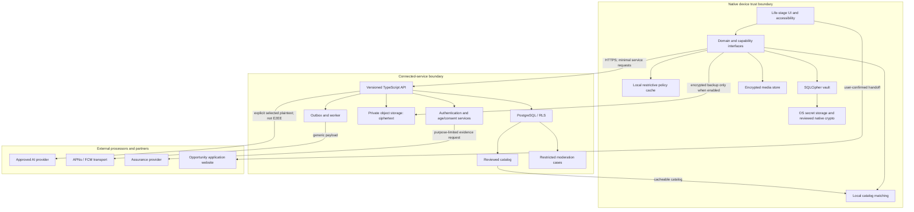

# System architecture

**Style:** native local-first client + modular cloud monolith. **Status:** proposed baseline; no deployed infrastructure.

## 1. System boundaries

HerPages has two different systems: an intimate on-device vault and a connected service. They share a user experience, not unrestricted data access. The cloud cannot provide private content search, moderation or AI over material it never receives. Connected posts and application data are deliberately disclosed and follow different rules.

## 2. Application topology

`apps/mobile`: React Native/Expo application with native vault and local operations. `apps/web`: Next.js public/catalog pages plus separately routed partner/admin areas. Begin with one web deployment only if role isolation, caching and headers are explicit; split later when assurance requirements justify it. `services/api`: Fastify TypeScript modular API. `services/worker`: same codebase and domain modules, separate process for durable jobs.

`packages/domain`: pure business rules. `packages/policy`: capability evaluation and policy contracts. `packages/design-tokens`: shared palette and measurements. `packages/contracts`: generated types/validators from versioned contracts. `packages/vault-port`: storage/crypto interfaces with native adapters; no server crypto fallback. `packages/catalog`: local filtering and match explanations.

These paths describe the planned repository, not directories already implemented. No ten-service deployment, Kubernetes cluster, Kafka or vector database is needed initially.

## 3. Native private plane

A vault contains Pages, interests, local goals, routine events, media references, local search index and key-version metadata. SQLCipher protects the database file; attachments and temporary files need separate encryption. Native secure storage protects a small bootstrap/wrapping secret. The app can still expose plaintext while unlocked; device malware, screenshots, coercion and a malicious client update are residual threats.

Local-only mode makes no vault-content upload. Catalog downloads and optional account use still disclose network metadata. Local operations continue during cloud outage. An explicit feature request may export selected content, but this is a visible trust-boundary crossing.

## 4. Connected plane

The API manages service identities, verified relationships, consent, catalog publication, organization tenancy, encrypted-backup object permissions, moderation and entitlements. It never persists plaintext diary content as convenience fields.

Authentication identifies a principal. Authorization evaluates capability + resource scope + current assurance + consent + relationship + feature gate. Supabase RLS supplies database defense in depth. Backend use of elevated keys is restricted to explicit privileged adapters; an all-powerful service role on every request would defeat the intended protections.

Catalog read models may be publicly cacheable after editorial publication. Authenticated pages, consent receipts, backup metadata and applications must not enter public CDN caches. Personalized matching for the baseline occurs locally, not on a centrally stored interests vector.

## 5. API and worker responsibilities

Synchronous: authorize, validate, transact, issue bounded upload/download grants and return acknowledged state. Asynchronous: verify object availability, finalize snapshot, send minimal notifications, recheck catalogs, process deletion and approved exports. Commit an outbox event in the same transaction as a state change. Workers are idempotent and check current permissions again before disclosure.

No long-running AI, media scan or export runs inside an arbitrary web request timeout. No real-time subscription channel broadcasts personal records to all authenticated users. `user_id` or `org_id` is never accepted as the sole proof of access.

## 6. Separate safety and community domains

Community posts are server-readable and moderated; E2EE vault content is not. Reporting discloses only a user-selected item or connected-content reference. Do not promise that moderators proactively inspect encrypted journals. The emergency-resource directory is cached and independent of login; optional location sessions use a separate expiring data class and remain disabled initially.

## 7. Deployment proposal

Use a reviewed India-region primary service-data/storage deployment when vendor capabilities and contracts are confirmed. API/worker containers can run on a managed container service; public web may use Vercel. Selecting an Indian database region does not establish end-to-end residency: CDN logs, auth emails, crash tools, push providers, backups, support and AI subprocessors need a documented flow inventory.

Dev uses synthetic data. Staging has separate accounts, storage, keys and domains. Production is provisioned only after approval; no builder preview connects to production. GitHub/EAS build systems must never receive user vault material.

## 8. Offline and conflict model

Initial encrypted backup is versioned single-writer snapshots, not a claim of seamless multi-device live sync. Use immutable manifests, monotonically increasing sequence, parent snapshot and compare-and-swap finalization. Two device heads create a visible conflict; preserve both. Consent, revocation and deletion are server-authoritative when connected and never last-write-wins.

Later collaborative sync needs a separate reviewed protocol and explicit per-record conflict semantics. A generic database replication library cannot sync plaintext vault tables without breaking the privacy architecture.

## 9. Scale and portability

Start with Postgres indexes and paginated queries. Cache public catalog revisions; cap object size, attachment count and model budgets. Instrument aggregate service health without vault payloads. Split a service only for measured load, isolation or operational ownership.

Export schemas and crypto versions must be documented. Restore tests include older formats. Use ordinary Git, standard database migrations and adapter boundaries so Bolt, Codex or a human team can continue. A future shutdown provides an export window and decryptable local archives without depending on a proprietary running server.

## 10. Architecture acceptance

Prove offline save/search, no network plaintext leakage, device-loss recovery, snapshot conflict behavior, stale-token denials, role separation, catalog freshness, accessibility and reproducible native builds. A Mermaid diagram is not architecture validation; the spike and test evidence are required.
